# Claude-Sync Data Flow Architecture

This document specifies the detailed data flow patterns for the claude-sync system, defining how data moves through hooks, learning storage, agent systems, and cross-host synchronization.

## 1. Hook Execution Lifecycle

### 1.1 UserPromptSubmit Hook Flow

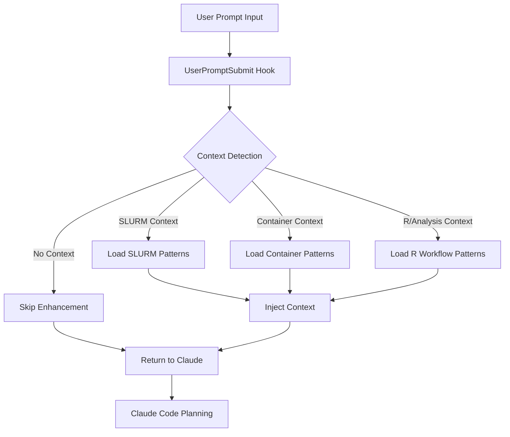

**Data Structures:**
```python
# Input to UserPromptSubmit hook
{
    "user_prompt": "Help me optimize this SLURM job",
    "context": {
        "timestamp": 1704067200,
        "session_id": "abc123",
        "working_directory": "/home/user/project"
    }
}

# Output from UserPromptSubmit hook
{
    "block": false,
    "message": "🧠 **Added SLURM context:**\nOptimal partition: compute (avg queue time: 5min)\nMemory efficiency: 80% utilization typical\nRecommended flags: --mem=32G --cpus-per-task=8"
}
```

### 1.2 PreToolUse Hook Flow

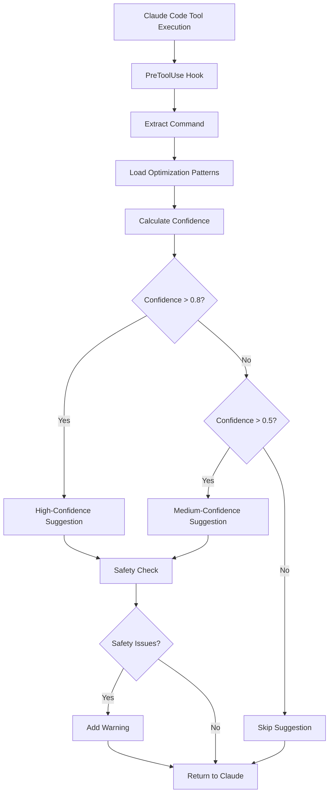

**Performance Contract:**
- Execution time: <10ms (95th percentile)
- Memory usage: <10MB
- Pattern lookup: <1ms
- Safety check: <5ms

**Data Flow:**
```python
# PreToolUse input
{
    "tool_name": "Bash",
    "tool_input": {
        "command": "sbatch --mem=64G run_analysis.sh",
        "description": "Submit SLURM job"
    },
    "context": {...}
}

# PreToolUse processing steps
1. Extract command pattern: "sbatch --mem=* *.sh"
2. Lookup optimization patterns: get_patterns("slurm_job")
3. Calculate confidence: 0.92 (high confidence)
4. Generate suggestion: "--mem=32G based on historical usage"
5. Safety check: No dangerous flags detected
6. Format response with confidence level

# PreToolUse output
{
    "block": false,
    "message": "🚀 **High-confidence optimization:**\n```bash\nsbatch --mem=32G --cpus-per-task=8 run_analysis.sh\n```\n📊 Success rate: 92% | Avg savings: 15min queue time"
}
```

### 1.3 PostToolUse Hook Flow

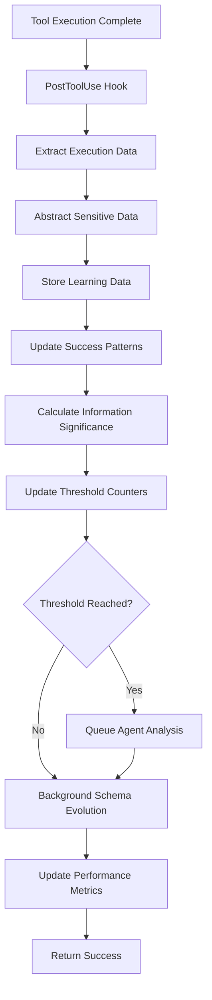

**Data Processing Pipeline:**
```python
# Step 1: Extract execution data
execution_data = CommandExecutionData(
    command="sbatch --mem=32G run_analysis.sh",
    exit_code=0,
    duration_ms=3500,
    timestamp=1704067200,
    session_id="abc123",
    working_directory="/home/user/project",
    host_context={
        "slurm_partition": "compute",
        "available_memory": "512GB",
        "queue_time": "2min"
    }
)

# Step 2: Abstract sensitive data
abstracted_data = {
    "command_pattern": "slurm_job_submission",
    "resource_pattern": "medium_memory_job",
    "success_indicators": ["job_accepted", "normal_completion"],
    "performance_tier": "efficient",
    "host_type": "compute_cluster"
}

# Step 3: Store with encryption
encrypted_storage.store_pattern(abstracted_data, context="slurm_learning")

# Step 4: Update information thresholds
threshold_manager.accumulate_information(
    info_type="optimizations",
    significance=2.0,  # Successful optimization applied
    context={"command_type": "slurm", "optimization_accepted": True}
)
```

## 2. Learning Data Pipeline

### 2.1 Data Abstraction Flow

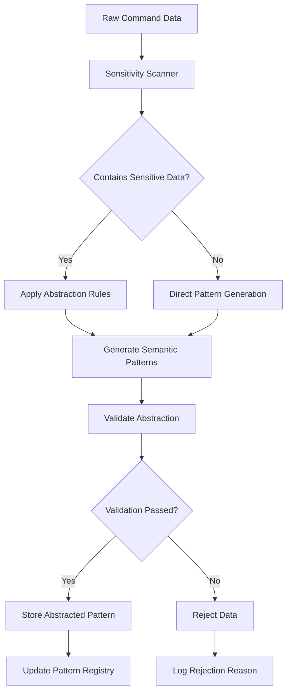

**Abstraction Rules:**
```python
class AbstractionRules:
    """Rules for converting sensitive data to safe patterns"""
    
    HOSTNAME_PATTERNS = {
        r'.*gpu.*': 'gpu-host',
        r'.*compute.*': 'compute-host',
        r'.*storage.*': 'storage-host',
        r'.*login.*': 'login-host'
    }
    
    PATH_PATTERNS = {
        r'/data/.*genomics.*': 'genomics-data',
        r'/scratch/.*': 'scratch-space',
        r'/home/.*': 'user-home',
        r'.*\.fastq.*': 'sequence-data'
    }
    
    COMMAND_PATTERNS = {
        r'sbatch.*--mem=\d+G.*': 'slurm_memory_job',
        r'singularity exec.*\.sif.*': 'container_execution',
        r'Rscript.*\.R.*': 'r_script_execution'
    }
```

### 2.2 Encrypted Storage Pipeline

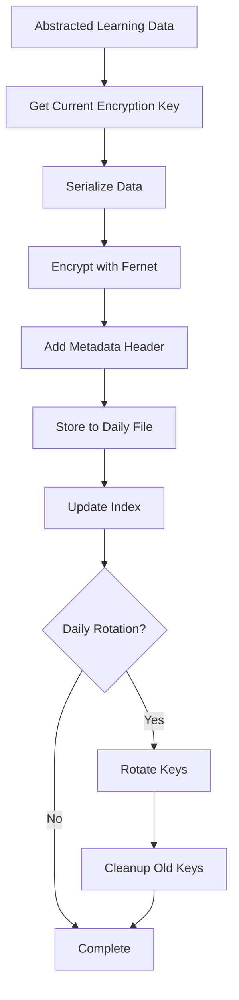

**Storage Format:**
```python
# Encrypted file structure
{
    "header": {
        "version": "1.0",
        "key_id": "2024-01-01",
        "host_id_hash": "abc123...",
        "created_at": 1704067200,
        "data_type": "learning_patterns"
    },
    "encrypted_payload": b"gAAAAABh..."  # Fernet encrypted data
}

# Decrypted payload structure
{
    "patterns": [
        {
            "pattern_id": "slurm_001",
            "command_category": "slurm_job_submission",
            "success_rate": 0.92,
            "optimization_suggestions": ["reduce_memory", "use_compute_partition"],
            "performance_characteristics": {
                "avg_duration": 3600,
                "memory_efficiency": 0.8,
                "queue_time": 300
            }
        }
    ],
    "schema_version": "1.2",
    "last_updated": 1704067200
}
```

### 2.3 Adaptive Schema Evolution Flow

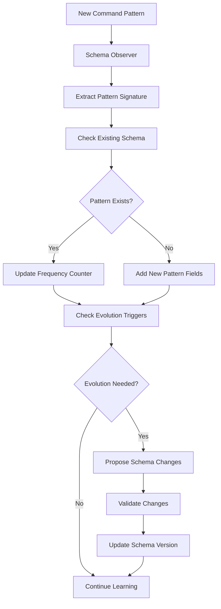

**Schema Evolution Example:**
```python
# Week 1: Basic SLURM pattern
initial_schema = {
    "slurm_job": {
        "required_fields": ["command", "memory", "time", "partition"],
        "optional_fields": [],
        "frequency": 25
    }
}

# Week 4: GPU usage detected in 80% of jobs
evolved_schema = {
    "slurm_job": {
        "required_fields": ["command", "memory", "time", "partition"],
        "optional_fields": ["gpu_type", "gpu_count"],  # NEW
        "frequency": 156
    },
    "gpu_slurm_job": {  # NEW specialized pattern
        "required_fields": ["command", "memory", "time", "partition", "gpu_type"],
        "optional_fields": ["cuda_version", "gpu_memory"],
        "frequency": 78
    }
}
```

## 3. Information Threshold System

### 3.1 Information Accumulation Flow

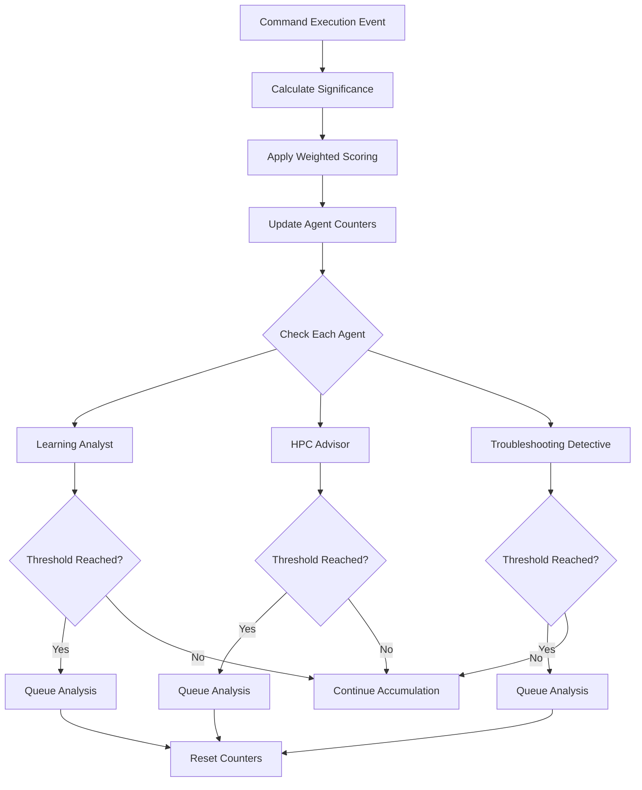

**Significance Calculation:**
```python
def calculate_significance(execution_data: CommandExecutionData) -> float:
    """Calculate information significance with contextual weighting"""
    base_significance = 1.0
    
    # Command novelty (higher = more significant)
    command_frequency = get_command_frequency(execution_data.command)
    if command_frequency < 5:
        base_significance *= 2.0  # Rare command
    
    # Failure significance
    if execution_data.exit_code != 0:
        historical_success = get_success_rate(execution_data.command)
        if historical_success > 0.8:
            base_significance *= 3.0  # Usually successful command failed
        else:
            base_significance *= 1.5  # Expected failure
    
    # Performance anomaly
    expected_duration = predict_duration(execution_data.command)
    actual_duration = execution_data.duration_ms
    performance_ratio = abs(actual_duration - expected_duration) / expected_duration
    if performance_ratio > 0.5:
        base_significance *= (1 + performance_ratio)
    
    # Optimization impact
    if was_optimization_applied(execution_data):
        base_significance *= 1.8
    
    return min(base_significance, 10.0)  # Cap at 10x significance
```

### 3.2 Agent Triggering Flow

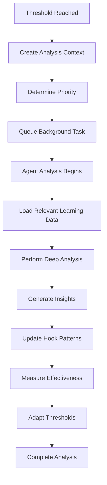

**Agent Context Creation:**
```python
def create_agent_context(agent_name: str, trigger_info: Dict) -> Dict[str, Any]:
    """Create rich context for agent analysis"""
    return {
        "agent_name": agent_name,
        "trigger_reason": f"Information threshold: {trigger_info['score']:.1f}",
        "accumulated_info": trigger_info["counters"],
        "priority": calculate_priority(trigger_info),
        "relevant_patterns": get_relevant_patterns(agent_name),
        "recent_failures": get_recent_failures() if agent_name == "troubleshooting-detective" else [],
        "performance_trends": get_performance_trends() if agent_name == "learning-analyst" else {},
        "analysis_scope": {
            "time_window_hours": 168,  # 1 week
            "max_patterns": 1000,
            "focus_areas": get_agent_focus_areas(agent_name)
        }
    }
```

## 4. Cross-Host Mesh Synchronization

### 4.1 Peer Discovery Flow

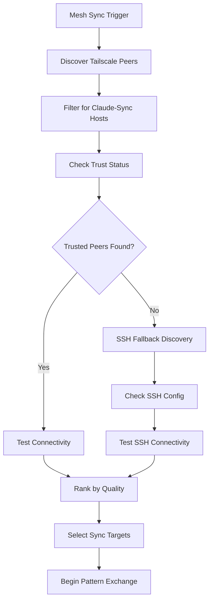

### 4.2 Pattern Synchronization Flow

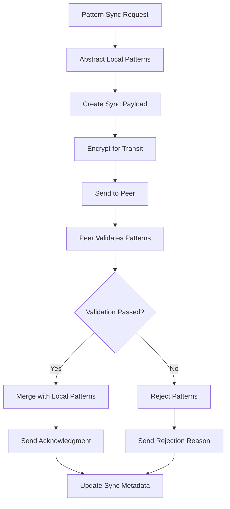

**Sync Pattern Structure:**
```python
# Patterns safe for cross-host sharing
sync_pattern = {
    "pattern_id": "cmd_optimization_001",
    "command_category": "text_search",  # NOT real command
    "success_rate": 0.92,
    "performance_tier": "fast",
    "optimization_type": "tool_upgrade", 
    "confidence": 0.85,
    "usage_frequency": 47,
    "effectiveness_metrics": {
        "speed_improvement": 3.2,
        "error_reduction": 0.15
    },
    "created_by_host_type": "development_machine",
    "applicable_host_types": ["development_machine", "compute_cluster"]
}
```

## 5. Performance Monitoring Flow

### 5.1 Real-time Performance Tracking

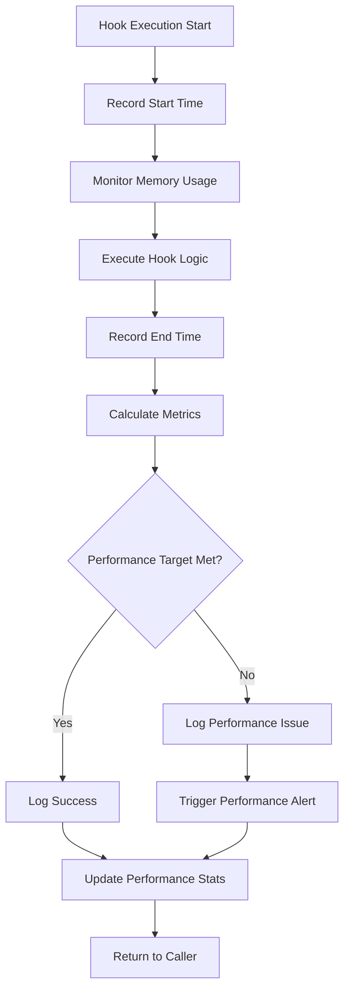

**Performance Metrics Collection:**
```python
@dataclass
class PerformanceMetrics:
    """Real-time performance metrics"""
    hook_name: str
    execution_time_ms: float
    memory_peak_mb: float
    cpu_time_ms: float
    pattern_lookups: int
    encryption_operations: int
    network_calls: int
    success: bool
    error_type: Optional[str] = None

def record_hook_performance(hook_name: str, metrics: PerformanceMetrics):
    """Record performance metrics for analysis"""
    # Update rolling averages
    update_performance_window(hook_name, metrics)
    
    # Check against targets
    if not meets_performance_targets(hook_name, metrics):
        trigger_performance_alert(hook_name, metrics)
    
    # Update long-term trends
    update_performance_trends(hook_name, metrics)
```

## 6. Error Handling and Recovery

### 6.1 Graceful Degradation Flow

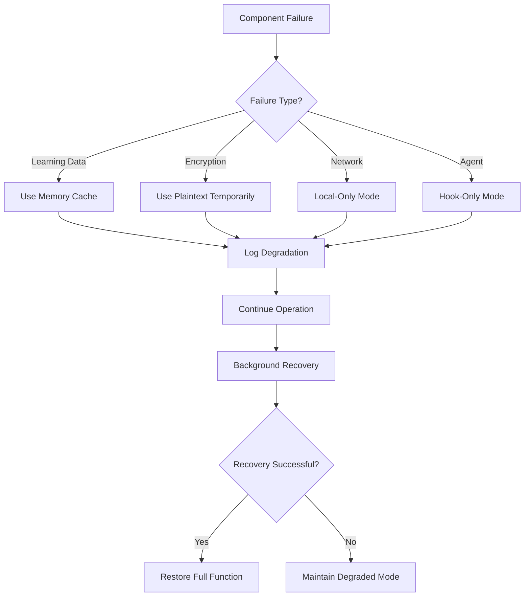

This data flow architecture ensures that claude-sync operates efficiently and reliably across all components while maintaining strict performance targets and security guarantees.